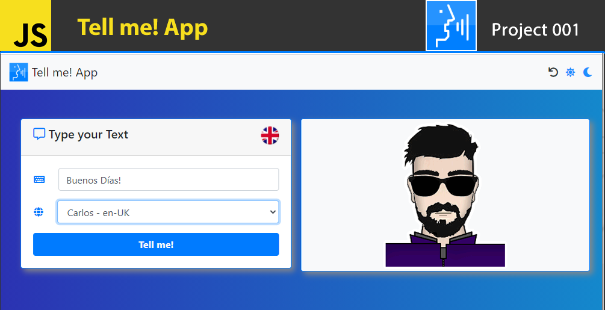

## Description

Basic App to manage Tasks (create, delete, monitoring)

## :books: Content

## Version: 1.0

- Working on web and android like an App
- Create Task function
- Delete Task function
- Define complete Task function
- Restart the Task manager
- Check monitoring for count of tasks and complete Tasks
- Watch starts
- Change a basic theme (light: by Default, dark)

## Access Link

[Run App](https://agzsoftsi.github.io/100_JavaScript_projects_Challenge/000_Project1_Task_list/index.html)

## Download APK

[Download](https://drive.google.com/file/d/15aiHPzrDrNeZ5muwXWxkDSLmDFHSOAnn/view?usp=sharing)

## Technologies:

- HTML
- CSS
- Javascript
- [Boostrap 4.5](https://getbootstrap.com/docs/4.5/getting-started/introduction/)
- [animate](https://animate.style/)
- [fontawesome](https://fontawesome.com/)

## Video DEMO

[DEMO](https://youtu.be/Y2xLfqu4DCQ)