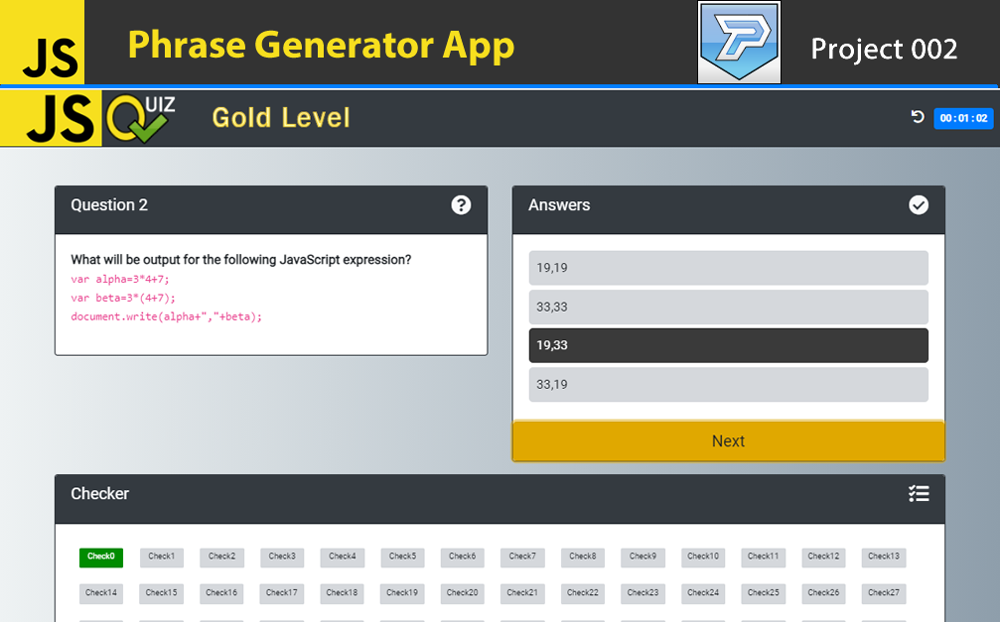

## Description

JSquizz App is a basic WebApp to testing your knowledge about the JavaScript basics, earn Badges and learn.

## :books: Content

## Version: 1.0

- Working on web and android like an App
- 3 levels implemneted
- 3 badges created to share on twitter
- 15 random questions for level 1
- 25 random questions for level 2
- 45 random questions for level 3
- questions, answers and checker tested
- Restart App function
- Support for Google Chrome, Firefox, Android

## Access Link

[Run App](https://agzsoftsi.github.io/100_JavaScript_projects_Challenge/003_Project4_JSQuizz/index.html)

## Download APK

[download](https://drive.google.com/file/d/1PmLOG2VIch7pJWmkl2oBC9U2uiGjX0uK/view?usp=sharing)

## Technologies:

- HTML
- CSS
- Javascript
- [Boostrap 4.5](https://getbootstrap.com/docs/4.5/getting-started/introduction/)
- [animate](https://animate.style/)
- [fontawesome](https://fontawesome.com/)

## Video DEMO

[DEMO](https://youtu.be/-ErPMKkTzxQ)